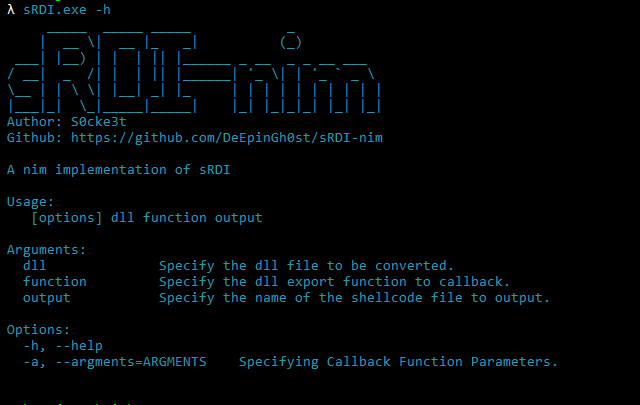
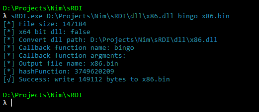
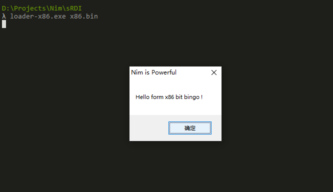

##  sRDI-nim

sRDI-nim是[sRDI](https://bbs.kanxue.com/thread-278642.htm)技术的nim语言实现,可实现将任意dll文件转换成与位置无关的shellcode并进行加载和执行.

## 截图



## 编译

在编译项目前请确保你正确安装了[nim](https://nim-lang.org/install_windows.html)环境及nimble包管理工具  
使用nimble安装以下依赖库

```
nimble install winim == 3.9.2
nimble install argparse == 4.0.1
```
### 编译转换器

你可以在项目根目录下执行
```
nimble build
```
进行自动编译操作或执行以下命令进行手动编译
```
nim c -d:release -d:danger -o:sRDI.exe src/sRDI.nim
```
### 编译加载器
**此操作需要你配置你的编译器路径(nim.cfg),如: mingW或其他编译器**  
如下是一个示例
```
amd64.windows.gcc.path = "D:\\mingw64\\bin"
amd64.windows.gcc.exe = "gcc.exe"
amd64.windows.gcc.linkerexe = "gcc.exe"
i386.windows.gcc.path = "D:\\mingw32\\bin"
i386.windows.gcc.exe = "gcc.exe"
i386.windows.gcc.linkerexe = "gcc.exe"
```
执行以下命令进行手动编译  
```
x64
nim c --cpu:amd64 -d:release -d:danger -o:loader.exe src/loader.nim
x86
nim c --cpu:i386 -d:release -d:danger -o:loader-x86.exe src/loader.nim
```
### 编译测试dll
此操作同样需要配置你的编译器
```
x64
nim c --cpu:amd64 -d:release -d:danger --app:lib -o:dll/x64.dll src/dll.nim
x86
nim c --cpu:i386 -d:release -d:danger --app:lib -o:dll/x86.dll src/dll.nim
```
## 运行测试

我们提供了编译好的二进制文件,如果你觉得提供的文件有风险,可按照上节操作进行手动编译

### 转换器

```
λ sRDI.exe -h
     _____  _____ _____            _
    |  __ \|  __ |_   _|          (_)
 ___| |__) | |  | || |______ _ __  _ _ __ ___
/ __|  _  /| |  | || |______| '_ \| | '_ ` _ \
\__ | | \ \| |__| _| |_     | | | | | | | | | |
|___|_|  \_|_____|_____|    |_| |_|_|_| |_| |_|
Author: S0cke3t
Github: https://github.com/DeEpinGh0st/sRDI-nim

A nim implementation of sRDI

Usage:
   [options] dll function output

Arguments:
  dll              Specify the dll file to be converted.
  function         Specify the dll export function to callback.
  output           Specify the name of the shellcode file to output.

Options:
  -h, --help
  -a, --argments=ARGMENTS    Specifying Callback Function Parameters.
```


### 加载器
```
λ loader.exe -h
A nim implementation of sRDI loader

Usage:
   [options] binfile

Arguments:
  binfile          Specify the shellcode file.

Options:
  -h, --help
```

## 致谢
- [sRDI](https://github.com/monoxgas/sRDI)
- [Doge-sRDI](https://github.com/timwhitez/Doge-sRDI)